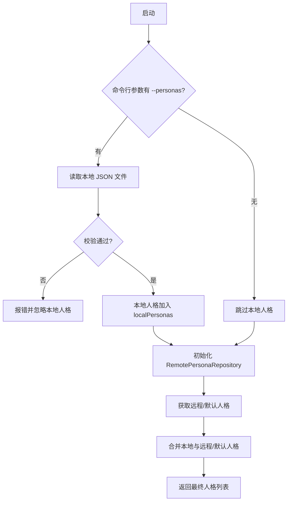

# PLAN-1: 实现本地人格文件加载功能

**目标:** 允许用户通过 `--personas` 命令行参数，从一个本地 JSON 文件加载自定义的人格，并将其与现有的人格数据（远程、默认）进行合并。

**负责人:** AI Assistant  
**状态:** 待办

---

### 任务分解 (Task Breakdown)

#### 1. 依赖与项目设置
- [ ] 安装命令行参数解析库 `commander`，为后续参数扩展做准备。
  ```bash
  npm install commander
  ```
- [ ] 确保 `.plans` 目录存在于项目根目录。

#### 2. 类型定义 (`src/types.ts`)
- [ ] 在 `Persona` 接口中增加可选字段 `source`，用于标记人格来源。
  ```typescript
  export interface Persona {
    // ... 现有字段
    source?: 'local' | 'remote' | 'default';
  }
  ```

#### 3. 主要逻辑 (`src/persona-repository.ts`)
- [ ] 修改 `RemotePersonaRepository` 构造函数，支持接收本地人格数组 `localPersonas: Persona[]`。
- [ ] 增加私有属性 `private localPersonas: Persona[] = []`，并在构造时初始化，标记 `source` 为 `'local'`。
- [ ] 新增私有方法 `mergePersonas`，合并本地与远程/默认人格，`id` 冲突时本地优先。
- [ ] 修改 `getAllPersonas`，在返回前合并本地人格。
- [ ] 确保 `getPersona` 也能查找合并后的人格。

#### 4. 应用入口 (`src/server.ts`)
- [ ] 使用 `commander` 解析 `--personas <file>` 参数。
- [ ] 读取本地文件，解析为 JSON。
- [ ] 健壮性校验：
    - [ ] 文件不存在、JSON 解析失败、内容非数组等情况友好报错。
    - [ ] 校验每个人格对象的必要字段。
- [ ] 将本地人格数组传递给 `RemotePersonaRepository`。

#### 5. 文档
- [ ] 更新 `README.md`，说明 `--personas` 用法，给出示例。
- [ ] 提供标准 `personas.json` 示例。

---

### 流程图


