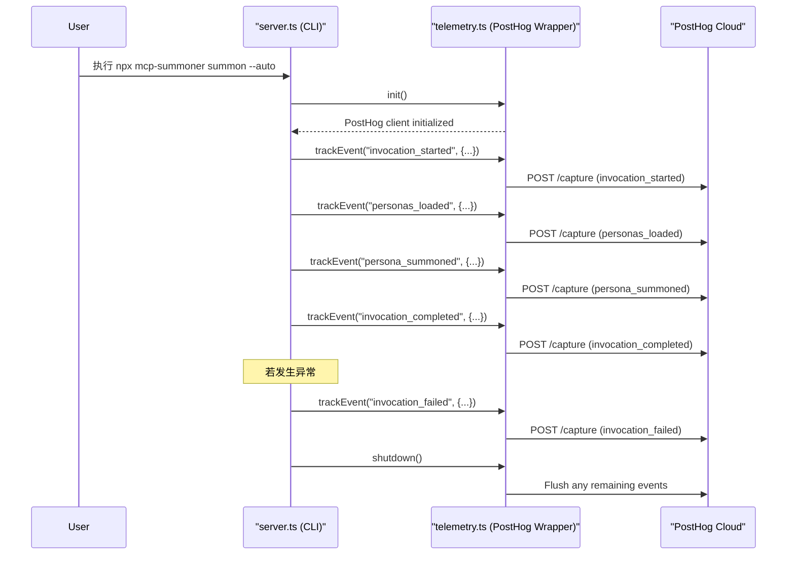

# PLAN-2: 集成 PostHog 实现产品分析遥测

**目标:** 引入 PostHog 实现一个对用户透明、可随时退出的轻量级匿名遥测系统，以收集用于产品改进和市场分析的使用数据。

**负责人:** AI Assistant  
**状态:** 已完成

---

### 核心原则

1.  **隐私第一**: 绝不收集任何个人身份信息 (PII)。使用 PostHog 的匿名 `distinctId` 机制。 [x]
2.  **完全透明**: 向用户清晰地说明收集了什么数据、为什么收集，以及数据将发送到 PostHog。 [x]
3.  **用户可控**: 提供简单、明确的方式让用户选择退出 (Opt-out)，包括环境变量和命令行标志。 [x]

> 本节已全部完成。

### 任务分解 (Task Breakdown)

#### 1. 依赖与基础设置
- [x] 添加依赖：`posthog-node` 用于与 PostHog 交互，`uuid` 用于生成持久化的匿名ID。
  ```bash
  npm install posthog-node uuid
  npm install --save-dev @types/uuid
  ```
- [x] 从 PostHog 网站获取 `Project API Key` 和 `Host` 地址。这些信息将作为配置项。
- [x] 新建 `src/telemetry.ts`，封装所有与 PostHog 相关的遥测逻辑。
- [x] 设计本地配置（如 `~/.config/persona-summoner/config.json`），用于存储持久化的匿名ID。

> 本节已全部完成。

#### 2. `src/telemetry.ts` 模块实现
- [x] 实现 `init` 函数：
    - [x] 检查 opt-out 条件（环境变量 `MCP_TELEMETRY_DISABLED` 或 `--no-telemetry`）。
    - [x] 若未 opt-out，检查/生成并保存匿名ID (`distinctId`) 到本地配置文件。
    - [x] 使用从 PostHog 获取的 API Key 和 Host 初始化 `PostHog` 客户端。
- [x] 实现 `trackEvent` 函数：
    - [x] 接收 `eventName` 和 `properties`。
    - [x] 若禁用遥测则直接返回。
    - [x] 调用 `posthog.capture()` 方法，将事件发送到 PostHog。必须包含 `distinctId`。
- [x] 实现 `shutdown` 函数：
    - [x] 调用 `posthog.shutdown()` 以确保在程序退出前所有缓冲的事件都被发送出去。

> 本节已全部完成。

#### 3. 事件集成 (CLI 生命周期与产品分析导向)

| 事件名称                | 触发时机/说明 | 主要属性（建议） | 完成情况 |
|------------------------|--------------|-----------------|----------|
| invocation_started     | 每次 CLI 命令启动 | app_version, is_ci, command, raw_args | [x] |
| invocation_completed   | 命令正常结束 | command, duration_ms, status | [x] |
| invocation_failed      | 命令异常退出 | command, duration_ms, status, error_type, error_message | [x] |
| persona_summoned       | 成功召唤人格 | method, persona_ids, persona_sources, persona_count | [x] |
| personas_loaded        | 加载人格文件后 | source_types, local_count, remote_count, total_count, error_count | [x] |

- [x] 所有事件自动附加 node_version、platform、arch 等通用属性。
- [x] `distinctId` 由本地配置文件持久化，确保升级后不变。

> 本节已全部完成。

#### 4. 用户控制与透明度
- [x] 在 `commander` 中增加 `--no-telemetry` 标志，用于在 `init` 时强制禁用遥测。
- [x] 更新 `README.md`，增加"遥测与隐私"章节，说明：
    - [x] 我们使用 PostHog 进行产品分析。
    - [x] 收集的数据类型（匿名化的使用事件）。
    - [x] 收集数据的目的（为了改进产品）。
    - [x] 如何通过设置 `MCP_TELEMETRY_DISABLED=1` 环境变量或 `--no-telemetry` 参数来禁用遥测。

> 本节已全部完成。

---

### 流程示意



> 本计划已全部完成。

