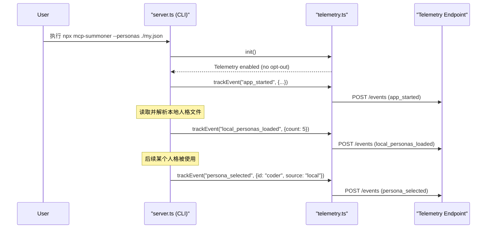

# PLAN-2: 实现匿名遥测功能

**目标:** 引入一个对用户透明、可随时退出的轻量级匿名遥测系统，以收集用于产品改进的使用数据和错误报告。

**负责人:** AI Assistant  
**状态:** 待办

---

### 核心原则

1.  **隐私第一**: 绝不收集任何个人身份信息 (PII)。所有数据都是匿名的。
2.  **完全透明**: 向用户清晰地说明收集了什么数据、为什么收集。
3.  **用户可控**: 提供简单、明确的方式让用户选择退出 (Opt-out)。

### 任务分解 (Task Breakdown)

#### 1. 依赖与基础设置
- [ ] 添加依赖：`axios` 用于发送 HTTP 请求，`uuid` 用于生成匿名ID。
  ```bash
  npm install axios uuid
  npm install --save-dev @types/uuid
  ```
- [ ] 新建 `src/telemetry.ts`，封装所有遥测逻辑。
- [ ] 设计本地配置（如 `~/.config/persona-summoner/config.json`），用于存储匿名ID。

#### 2. `src/telemetry.ts` 模块实现
- [ ] 实现 `init` 函数：
    - [ ] 检查 opt-out 条件（环境变量 `MCP_TELEMETRY_DISABLED` 或 `--no-telemetry`）。
    - [ ] 若未 opt-out，检查/生成并保存匿名ID。
- [ ] 实现 `trackEvent` 函数：
    - [ ] 接收 `eventName` 和 `properties`。
    - [ ] 若禁用遥测则直接返回。
    - [ ] 构造 payload（含匿名ID、事件名、属性、时间戳、版本号）。
    - [ ] 用 `axios.post` 异步发送，失败不影响主程序。

#### 3. 事件集成
- [ ] `app_started`：在 `main` 入口调用，记录平台、Node 版本等。
- [ ] `local_personas_loaded`：本地人格加载成功后调用，记录数量。
- [ ] `persona_selected`：人格被选用时调用，记录ID和来源。
- [ ] `app_crashed`：全局异常捕获，记录匿名错误堆栈（需脱敏）。

#### 4. 用户控制与透明度
- [ ] `commander` 增加 `--no-telemetry` 标志。
- [ ] 更新 `README.md`，说明遥测内容、用途、如何禁用。
- [ ] （可选）创建 `PRIVACY.md`，详细说明隐私政策。

---

### 时序图



</rewritten_file> 